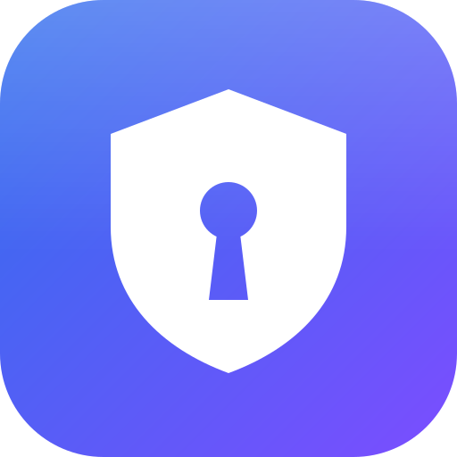
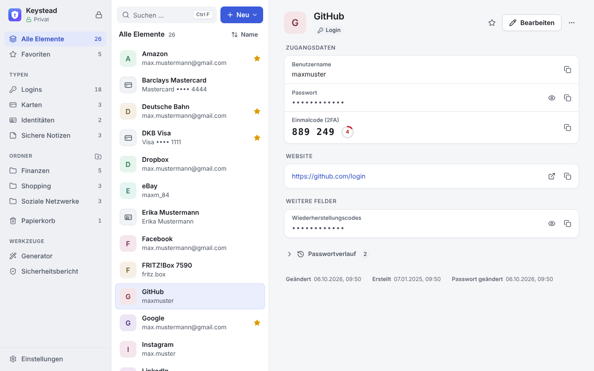
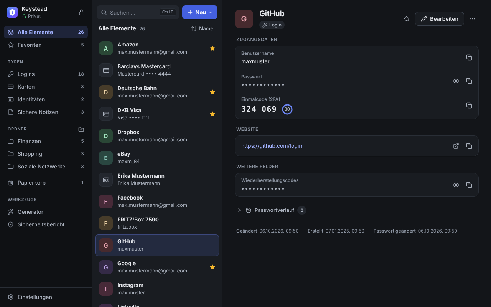
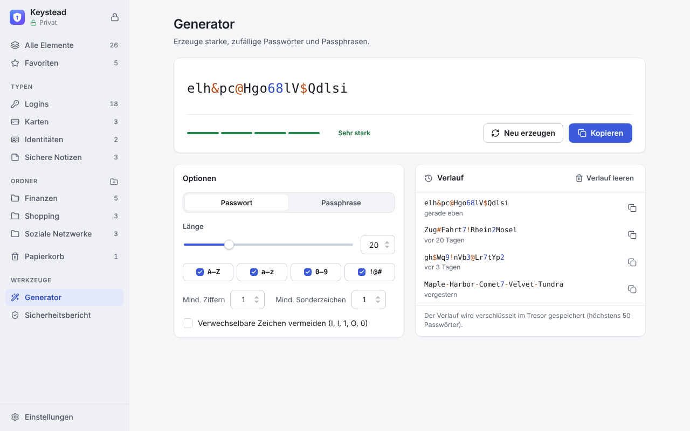
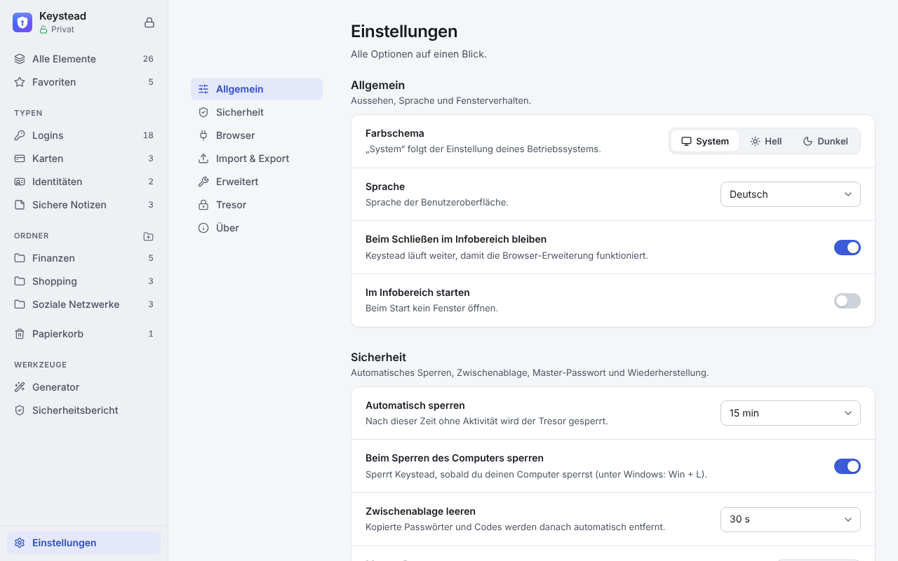

<p align="center">
  
</p>

<h1 align="center">Keystead</h1>

<p align="center">
  Lokaler Passwort-Manager für Windows – mit Browser-Erweiterung und Terminal-Version.<br>
  <em>A local password manager for Windows – with a browser extension and a terminal version.</em>
</p>

<p align="center">
  <a href="#deutsch">Deutsch</a> · <a href="#english">English</a>
</p>

<p align="center">
  
</p>

<p align="center">
  
  
  
</p>

---

<a id="deutsch"></a>

## Was ist Keystead?

**Keystead** = *Key* + *Homestead*: deine Schlüssel bleiben zu Hause. Keystead ist
ein Passwort-Manager im Stil von Bitwarden oder 1Password – aber **komplett lokal**.
Es gibt keinen Server, kein Konto und keine Cloud-Synchronisation; deine Tresore
liegen verschlüsselt auf deinem Rechner und verlassen ihn nie.

Keystead 2.0 ist der Nachfolger von VaultX 1.x (PowerShell). Alte VaultX-Tresore
lassen sich übernehmen, siehe [Alte VaultX-Tresore](#alte-vaultx-tresore).

> **Status:** Testversion (Beta). Erstelle regelmäßig einen verschlüsselten Export
> als Sicherung.

### Funktionen

- **Tresore** für Logins, Zahlungskarten, Identitäten und sichere Notizen – mit
  Ordnern, Favoriten, Papierkorb, eigenen Feldern und Passwortverlauf.
- **Website-Icons**: Logins zeigen automatisch das Icon ihrer Website – die App
  lädt es selbst direkt von der Website (kein Icon-Dienst) und speichert es
  verschlüsselt im Tresor; abschaltbar unter Einstellungen → Allgemein.
- **Generator** für Passwörter und Passphrasen (EFF-Wortliste) mit Verlauf.
- **Einmalcodes (TOTP/2FA)** direkt im Eintrag, kompatibel mit Google Authenticator & Co.
- **Sicherheitsbericht**: schwache, mehrfach verwendete und alte Passwörter.
- **Wiederherstellungsschlüssel**, falls das Master-Passwort vergessen wird.
- **Automatische Sperre** nach Inaktivität und beim Sperren des Computers;
  kopierte Passwörter werden aus der Zwischenablage gelöscht.
- **Browser-Erweiterung** für Chrome, Edge, Brave, Chromium und Vivaldi: Logins
  ausfüllen, neue Logins speichern, Passwörter generieren.
- **Terminal-Version** (`keystead-cli`) mit Vollbild-Oberfläche und Befehlen für Skripte.
- **Import** aus VaultX 1.x, Chrome, Edge, Firefox, Bitwarden (CSV/JSON) und
  Keystead-Exporten – Datei einfach ins Fenster ziehen, das Format wird erkannt.
  Eine Vorschau zeigt vorher, was neu ist; vorhandene Einträge werden nicht doppelt
  übernommen, bei geändertem Passwort entscheidest du. **Export** als verschlüsselte
  `.keystead`-Datei, CSV oder Bitwarden-JSON.
- **Portabler Modus** (Daten neben der EXE, z. B. auf einem USB-Stick),
  Infobereich-Symbol, helles/dunkles Design, Deutsch und Englisch.

### Download & Schnellstart

1. Unter [Releases](../../releases) die neueste
   Version herunterladen:
   - `Keystead-<version>-windows-portable.zip` – entpacken und `Keystead.exe`
     starten, keine Installation nötig. Enthält auch `keystead-cli.exe`, den Ordner
     `browser-extension` und die Kurzanleitung `LIESMICH.txt`.
   - `Keystead-<version>-windows-setup.exe` – klassischer Installer (ohne
     Administratorrechte; installiert nach `%LOCALAPPDATA%\Keystead`, ohne portablen
     Modus). Die installierte Version **aktualisiert sich selbst**, siehe [Updates](#updates).
   - `Keystead-<version>-browser-extension.zip` – nur die Browser-Erweiterung.
2. Die EXE ist nicht signiert. Zeigt Windows SmartScreen „Der Computer wurde durch
   Windows geschützt“, auf „Weitere Informationen“ → „Trotzdem ausführen“ klicken.
3. Beim ersten Start einen Tresor anlegen und ein starkes Master-Passwort wählen.
   Danach gleich einen **Wiederherstellungsschlüssel** erstellen und sicher
   aufbewahren – ohne ihn ist ein vergessenes Master-Passwort nicht wiederherstellbar.

Voraussetzung: Windows 10 oder 11 (die benötigte WebView2-Laufzeit ist dort in aller
Regel schon installiert).

### Browser-Erweiterung einrichten

1. In Keystead: **Einstellungen → Browser-Integration** → beim Browser auf
   **Aktivieren** klicken (registriert den Native-Messaging-Host `com.keystead.bridge`).
2. Im Browser `chrome://extensions` (Edge: `edge://extensions`) öffnen, den
   **Entwicklermodus** einschalten, **Entpackte Erweiterung laden** und den Ordner
   wählen, den Keystead unter **Einstellungen → Browser-Integration** anzeigt
   (**Ordner öffnen** / **Pfad kopieren**) – das ist `browser-extension` im
   Datenordner, z. B. `%LOCALAPPDATA%\Keystead\browser-extension`. Die
   Erweiterungs-ID ist immer `imfndemblnaalppnmdplagajjielnaok`.
3. Auf das Keystead-Symbol in der Browserleiste klicken → **Mit Keystead verbinden**
   und den angezeigten 6-stelligen Code in der App bestätigen.

Keystead legt die Erweiterung bei jedem Start in diesen Ordner und hält sie dort
aktuell: Nach einem App-Update lädt sich die Erweiterung selbst neu. Wurde sie aus
einem anderen Ordner geladen (z. B. aus einer ZIP-Datei), zeigt ihr Popup „Neue
Plugin-Version verfügbar“ mit dem richtigen Ordner – dann einmal von dort laden.
Wird `Keystead.exe` verschoben, einfach einmal starten; die Registrierung wird
automatisch aktualisiert.

Tastenkürzel: `Strg+Umschalt+Y` öffnet das Popup, `Strg+Umschalt+L` füllt das
Login der Seite aus, `Strg+Umschalt+9` setzt ein neues Passwort ins aktive Feld.

<a id="updates"></a>

### Updates

Keystead sucht beim Start und danach alle 6 Stunden nach einer neuen Version
(abschaltbar unter **Einstellungen → Über Keystead**, dort auch **Nach Updates
suchen**). Ist eine da, erscheint oben ein Hinweis: **Jetzt aktualisieren** lädt das
Update, prüft seine **Signatur** (nur von den Keystead-Entwicklern signierte Updates
werden installiert), sperrt den Tresor und startet Keystead neu – **Später** blendet
den Hinweis bis zum nächsten Start aus.

- **Update-Kanal:** „Beta-Versionen“ (Standard während der Testphase, enthält auch
  stabile Versionen) oder „Nur stabile Versionen“.
- Die **portable ZIP-Version** aktualisiert sich nicht selbst; sie meldet neue
  Versionen mit einem Link zum Download.
- Bei der Prüfung wird nur eine Versionsdatei (`latest.json`) von GitHub abgerufen –
  keine Tresordaten, keine Kennungen.

### Terminal-Version

In der App unter **Einstellungen → Erweitert → Terminal öffnen**, mit
`Keystead.exe --cli` oder direkt in einer Konsole:

```text
keystead-cli                      Vollbild-Oberfläche (Tresor wählen, entsperren, suchen, kopieren)
keystead-cli vaults               alle Tresore auflisten
keystead-cli list                 Einträge eines Tresors auflisten
keystead-cli get github --copy    Passwort von „github“ kopieren (--field username|totp|notes|uri)
keystead-cli generate --length 24 Passwort erzeugen (--passphrase für eine Passphrase)
```

`--vault NAME` wählt den Tresor. Hilfe: `keystead-cli --help`.

### Wo liegen meine Daten?

| System | Ordner |
|---|---|
| Windows | `%LOCALAPPDATA%\Keystead` |
| Linux | `~/.local/share/keystead` |
| macOS | `~/Library/Application Support/Keystead` |
| Portabler Modus | Ordner `Keystead-Data` neben `Keystead.exe` |

Darin: `vaults\<id>.keystead` (verschlüsselter Tresor, plus `.bak` mit dem vorherigen
Stand), `settings.json` (Einstellungen, nicht geheim), `bridge-clients.json`
(verbundene Browser, nur Hashes) und `browser-extension` (die Browser-Erweiterung,
von der App verwaltet). Den portablen Modus schaltest du unter
**Einstellungen → Erweitert** um – oder du legst den Ordner `Keystead-Data` selbst an.

### Sicherheit in Kürze

- Jeder Tresor hat einen zufälligen 256-Bit-Schlüssel, der die Daten mit
  **XChaCha20-Poly1305** verschlüsselt. Das Master-Passwort wird mit **Argon2id**
  (64 MiB, 3 Durchläufe) zu einem Schlüssel, der nur diesen Tresorschlüssel umhüllt.
- Tresor-ID und Revision sind an den Geheimtext gebunden; Manipulationen fallen auf.
- Der Wiederherstellungsschlüssel (125 Bit) umhüllt den Tresorschlüssel ein zweites Mal.
- Beim Ändern des Master-Passworts oder des Wiederherstellungsschlüssels bekommt der
  Tresor einen neuen Schlüssel: Mit dem alten Geheimnis und einer alten Kopie der
  Datei lässt sich kein neuerer Stand öffnen. Ein vorhandener
  Wiederherstellungsschlüssel wird deshalb beim Ändern des Master-Passworts durch
  einen neuen ersetzt, den die App einmal anzeigt.
- Keine Netzwerkverbindungen für deine Daten: Die Erweiterung spricht per Native
  Messaging mit der App, die App lauscht nur auf einer lokalen Named Pipe bzw. einem
  Unix-Socket, die ausschließlich dem eigenen Benutzer zugänglich sind. Ins Internet
  gehen nur die (abschaltbare) Update-Prüfung bei GitHub und – ebenfalls abschaltbar –
  das Laden der Website-Icons.
- Website-Icons werden direkt bei der jeweiligen Website abgerufen (nur `https`,
  ohne Cookies, ohne Tresordaten); die Website sieht dabei wie bei jedem Besuch
  deine IP-Adresse. Einen eingerichteten Proxy umgeht die App nie: Ist für eine
  Website ein Proxy eingestellt (System oder `HTTPS_PROXY`), lädt sie deren Icon
  gar nicht. Adressen im lokalen Netz (Router, NAS, `localhost`) werden nie
  angefragt. Die Icons liegen verschlüsselt im Tresor, nicht als lose Dateien.
  Beachte: Zum Laden der Icons kontaktiert die App den Host jeder gespeicherten
  Website – auch von Seiten, die du in diesem Netz nie besuchst. DNS-Server, der
  Betreiber des Netzwerks (z. B. ein öffentliches WLAN) und große CDNs können
  daran die Liste der Websites in deinem Tresor erkennen. Wer das nicht möchte,
  schaltet „Website-Icons automatisch laden“ in den Einstellungen aus.
- Updates sind signiert (minisign/Ed25519); die App installiert nur Dateien mit
  gültiger Signatur für genau die angekündigte Version.
- Ein Browser wird erst nach Bestätigung eines 6-stelligen Codes in der App
  verbunden; gespeichert wird nur ein Hash seines Tokens.
- Die Erweiterung füllt nur nach einer Aktion des Nutzers aus und nur Logins, die
  zur tatsächlichen Adresse des Frames passen; `https`-Logins nie in `http`-Seiten.
- Die Oberfläche der App bekommt die Elementliste ohne Passwörter, 2FA-Schlüssel,
  Kartennummern und verborgene Felder. Ein Geheimnis lädt sie nur, wenn du es
  anzeigst (nach 30 s wieder verborgen) oder das Element bearbeitest; beim Kopieren
  kopiert die App selbst, ohne dass der Wert die Oberfläche erreicht.

Details: [docs/ARCHITECTURE.md](docs/ARCHITECTURE.md).

### Alte VaultX-Tresore

Tresore aus **VaultX 1.x** (der alten PowerShell-Version) übernimmst du beim
ersten Start über **„Von VaultX umsteigen“** oder später unter
**Einstellungen → Import & Export → Importieren**. Keystead findet sie automatisch unter
`%LOCALAPPDATA%\VaultX` (`accounts.json` + `vault_*.json`); entsperrt wird mit dem
alten Master- oder Wiederherstellungspasswort. Die frühere Zwei-Faktor-Sperre des
Tresors wird nicht übernommen. VaultX 1.x selbst liegt zum Nachschlagen im Ordner
[`legacy/`](legacy/).

Aus dem Quellcode bauen: siehe [Build from source](#build-from-source).

---

<a id="english"></a>

## What is Keystead?

**Keystead** = *Key* + *Homestead*: your keys stay at home. Keystead is a password
manager in the spirit of Bitwarden or 1Password – but **entirely local**. There is
no server, no account and no cloud sync; your vaults are stored encrypted on your
computer and never leave it.

Keystead 2.0 is the successor of VaultX 1.x (PowerShell); old VaultX vaults can be
imported (see [Legacy VaultX vaults](#legacy-vaultx-vaults)). The UI is German first
and also available in English.

> **Status:** beta. Keep an encrypted export as a backup.

### Features

- **Vaults** with logins, payment cards, identities and secure notes – folders,
  favourites, trash, custom fields and password history.
- **Website icons**: logins show their website's icon automatically – the app loads
  it itself, directly from the website (no icon service), and stores it encrypted in
  the vault; can be switched off in Settings → General.
- **Generator** for passwords and passphrases (EFF word list), with history.
- **One-time codes (TOTP/2FA)** inside items, compatible with Google Authenticator & co.
- **Security report**: weak, reused and old passwords.
- **Recovery key** in case the master password is forgotten.
- **Auto-lock** after inactivity and when the computer is locked; copied secrets are
  cleared from the clipboard.
- **Browser extension** for Chrome, Edge, Brave, Chromium and Vivaldi: fill logins,
  save new logins, generate passwords.
- **Terminal version** (`keystead-cli`) with a full-screen UI and script-friendly commands.
- **Import** from VaultX 1.x, Chrome, Edge, Firefox, Bitwarden (CSV/JSON) and Keystead
  exports – just drag the file into the window, the format is detected. A preview shows
  what is new first; existing entries are never imported twice, and you decide about
  changed passwords. **Export** as an encrypted `.keystead` file, CSV or Bitwarden JSON.
- **Portable mode** (data next to the exe, e.g. on a USB stick), tray icon, light/dark theme.

### Download & quick start

1. Get the latest version from [Releases](../../releases):
   - `Keystead-<version>-windows-portable.zip` – unzip and run `Keystead.exe`, no
     installation needed. Also contains `keystead-cli.exe`, the `browser-extension`
     folder and the German quick start `LIESMICH.txt`.
   - `Keystead-<version>-windows-setup.exe` – classic installer (no admin rights
     needed; installs to `%LOCALAPPDATA%\Keystead`, no portable mode). The installed
     version **updates itself**, see [In-app updates](#in-app-updates).
   - `Keystead-<version>-browser-extension.zip` – the browser extension only.
2. The exe is not code-signed. If Windows SmartScreen says "Windows protected your
   PC", click "More info" → "Run anyway".
3. Create a vault with a strong master password on first start, then create a
   **recovery key** and keep it safe – without it a forgotten master password cannot
   be recovered.

Requires Windows 10 or 11 (the WebView2 runtime they need is normally already installed).

### Browser extension setup

1. In Keystead: **Einstellungen → Browser-Integration** (Settings → Browser
   integration) → click **Aktivieren** (Enable) next to your browser. This registers
   the native messaging host `com.keystead.bridge`.
2. Open `chrome://extensions` (Edge: `edge://extensions`), enable **developer mode**,
   click **Load unpacked** and select the folder Keystead shows under
   **Einstellungen → Browser-Integration** (**Ordner öffnen** / **Pfad kopieren** –
   open folder / copy path): `browser-extension` in the data folder, e.g.
   `%LOCALAPPDATA%\Keystead\browser-extension`. The extension ID is always
   `imfndemblnaalppnmdplagajjielnaok`.
3. Click the Keystead toolbar icon → **Mit Keystead verbinden** (Connect to Keystead)
   and confirm the 6-digit code in the app.

Keystead writes the extension to that folder on every start and keeps it up to
date: after an app update the extension reloads itself. If it was loaded from
another folder (e.g. an unzipped download), its popup shows "Neue Plugin-Version
verfügbar" (new extension version available) with the right folder – load it from
there once. If you move `Keystead.exe`, start it once; the registration is updated
automatically. More: [extension/chrome/README.md](extension/chrome/README.md).

<a id="in-app-updates"></a>

### In-app updates

Keystead looks for a new version at start and every 6 hours (switch it off under
**Settings → About Keystead**, which also has **Check for updates**). A banner offers
**Update now**: the app downloads the update, verifies its **signature** (only
updates signed with the Keystead release key are installed), locks the vault and
restarts. **Later** hides the banner until the next start.

- **Update channel:** beta versions (default during the beta phase, includes stable
  releases) or stable versions only.
- The **portable ZIP version** does not update itself; it announces new versions with
  a download link.
- The check only fetches a version file (`latest.json`) from GitHub – no vault data,
  no identifiers.

### Terminal version

Open it from the app (**Settings → Advanced → Open terminal**), run
`Keystead.exe --cli`, or use `keystead-cli` in a console:

```text
keystead-cli                      full-screen UI (pick vault, unlock, search, copy)
keystead-cli vaults               list all vaults
keystead-cli list                 list the items of a vault
keystead-cli get github --copy    copy the password of "github" (--field username|totp|notes|uri)
keystead-cli generate --length 24 generate a password (--passphrase for a passphrase)
```

`--vault NAME` selects the vault; see `keystead-cli --help`. For scripts the master
password can be passed in `KEYSTEAD_MASTER_PASSWORD` (insecure – other programs and
the shell history may see it).

### Where is my data?

| System | Folder |
|---|---|
| Windows | `%LOCALAPPDATA%\Keystead` |
| Linux | `~/.local/share/keystead` |
| macOS | `~/Library/Application Support/Keystead` |
| Portable mode | `Keystead-Data` folder next to `Keystead.exe` |

It contains `vaults/<id>.keystead` (the encrypted vault, plus a `.bak` with the
previous version), `settings.json` (non-secret settings), `bridge-clients.json`
(paired browsers, hashes only) and `browser-extension` (the browser extension,
managed by the app). `KEYSTEAD_DATA_DIR` overrides the location.

### Security design

- Every vault has a random 256-bit vault key that encrypts the data with
  **XChaCha20-Poly1305**. The master password is stretched with **Argon2id**
  (64 MiB, t = 3, p = 4) into a key that only wraps the vault key.
- The vault id and revision are bound to the ciphertext as associated data; any
  modification of the file is detected.
- The optional recovery key (125 bits, Crockford base32) wraps the vault key a
  second time.
- Changing the master password or the recovery key gives the vault a new key: the
  old secret together with an old copy of the file opens no newer revision. An
  existing recovery key is therefore replaced by a new one (shown once) when the
  master password changes.
- No network access for your data: the extension talks to the app via Native
  Messaging; the app only listens on a local named pipe (Windows, restricted to the
  current user) or a Unix socket (mode 0600, peer uid checked). The only internet
  access is the update check against GitHub and loading website icons (both can be
  switched off).
- Website icons are fetched directly from each website (`https` only, no cookies, no
  vault data); like any visit, the site sees your IP address. The app never goes
  around a proxy: if one is configured for a site (system settings or
  `HTTPS_PROXY`), its icon is not loaded at all. Addresses in the local network
  (router, NAS, `localhost`) are never contacted. The icons are stored encrypted
  inside the vault, not as loose files. Note: to load the icons the app contacts
  the host of every saved website – also sites you never visit from this network.
  DNS resolvers, the network operator (e.g. a public Wi-Fi) and large CDNs can
  therefore see the list of websites in your vault. If you don't want that, turn
  off "Load website icons automatically" in the settings.
- Updates are signed (minisign/Ed25519): the app installs only files with a valid
  signature for exactly the announced version.
- A browser is paired only after you confirm a 6-digit code in the app; the app
  stores only a SHA-256 hash of the browser's token.
- The extension fills only after a user action, only logins that match the real URL
  of the frame, and never fills `https` logins into `http` pages.
- Secrets are zeroized in memory where practical, never logged, and copied secrets
  are excluded from the Windows clipboard history and cleared after a timeout.
- The app's web UI gets the item list without passwords, TOTP keys, card numbers
  and hidden fields. It loads a secret only when you reveal it (hidden again after
  30 s) or edit the item; copying is done by the app itself, the value never
  reaches the UI.

The full specification (file format, IPC protocol, commands) is in
[docs/ARCHITECTURE.md](docs/ARCHITECTURE.md).

### Build from source

Requirements: Rust (stable), Node.js 22; on Windows the MSVC build tools; on Linux
`libwebkit2gtk-4.1-dev libayatana-appindicator3-dev librsvg2-dev libxdo-dev libssl-dev`.

```sh
# Desktop app (Keystead / Keystead.exe, on Windows also the NSIS installer)
cd apps/desktop
npm ci
# Without the release signing key (TAURI_SIGNING_PRIVATE_KEY) skip the signed
# updater artifacts – the build itself is the same:
npx tauri build --config '{"bundle":{"createUpdaterArtifacts":false}}'
cd ../..

# Terminal version (keystead-cli / keystead-cli.exe)
cargo build --release -p keystead-tui
```

Binaries end up in `target/release/`. The browser extension (`extension/chrome`)
needs no build step.

Development:

```sh
cd apps/desktop
npm run dev          # UI in a normal browser with a mock backend (password: demo)
npx tauri dev        # the real desktop app

# checks (as in CI)
cargo fmt --all --check
cargo clippy --workspace --all-targets -- -D warnings
cargo test --workspace
node --test extension/tests/*.test.mjs .github/scripts/*.test.mjs
```

Releases: CI (`.github/workflows/build.yml`) versions every build
(`2.0.0-beta.<run>`, or the tag `v<version>`), signs the setup for the in-app updater
with the repository secret `TAURI_SIGNING_PRIVATE_KEY` (only builds that publish
get the secret) and publishes pre-releases
for commits with `[release]` (stable releases for tags without suffix); see
"Releases & in-app updates" in [docs/ARCHITECTURE.md](docs/ARCHITECTURE.md).
**After tagging a stable `vX.Y.Z`, set `version` in
`apps/desktop/src-tauri/tauri.conf.json` to the next version (e.g. `X.Y.(Z+1)`)** –
otherwise later betas (`X.Y.Z-beta.<run>`) sort below the release and are never
offered by the updater; CI warns, and refuses to publish such a beta.

### Project layout

| Path | Contents |
|---|---|
| `crates/keystead-core` | Crypto, vault file format, storage, generator, TOTP, import/export, URL matching, security report |
| `crates/keystead-bridge` | Browser bridge: protocol, native messaging host, local socket server, host registration |
| `crates/keystead-tui` | Terminal UI and the `keystead-cli` binary |
| `apps/desktop` | Desktop app: React + TypeScript UI (`src/`) and Tauri 2 backend (`src-tauri/`) |
| `extension/chrome` | Manifest V3 browser extension (plain JavaScript) |
| `assets` | Logo and icons |
| `docs` | Architecture & contracts, German quick start, screenshots |
| `legacy` | The old PowerShell VaultX 1.x, kept for reference |

### Legacy VaultX vaults

Vaults of **VaultX 1.x** (the old PowerShell version) can be imported on first start
(**"Von VaultX umsteigen"** / "Switch from VaultX") or later via
**Settings → Import & export → Import**.
Keystead finds them in `%LOCALAPPDATA%\VaultX` (`accounts.json` + `vault_*.json`)
and decrypts them with the old master or recovery password; the old vault-unlock
two-factor secret is not imported. The VaultX 1.x source stays in [`legacy/`](legacy/);
`version.yml` is only read by its auto-updater.

## License

Proprietary – free for personal, educational and non-commercial use; see
[LICENSE](LICENSE). © 2026 Cedrick Grabe.
